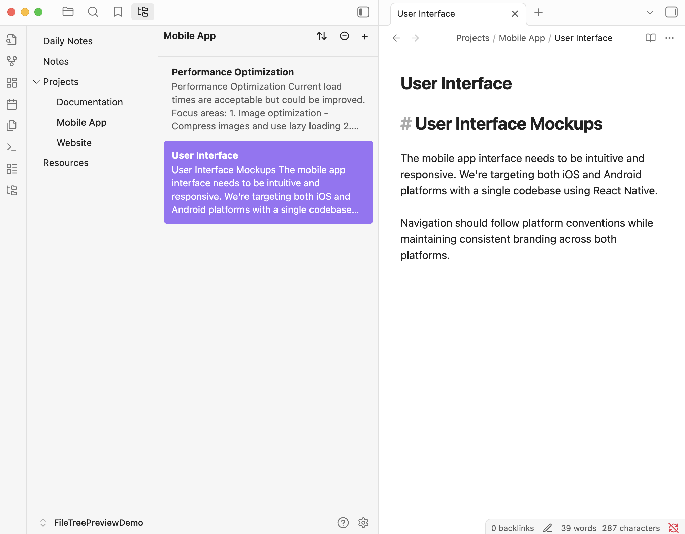

# File Tree Preview Plugin

An Obsidian plugin that displays folders in a tree structure with preview cards showing file content snippets.



## Features

### Navigation & Layout

- **Folder Tree Navigation**: Browse your vault folders in a hierarchical tree structure (left column)
- **Expandable/Collapsible Folders**: Click the caret (▶) next to folders with subfolders to expand/collapse
- **Folder State Persistence**: Expanded/collapsed state is saved and restored across sessions
- **Resizable Columns**: Drag the invisible divider between columns to adjust width (saved automatically)
- **Auto-Hiding Scrollbars**: Thin scrollbars appear only when hovering over each column

### Preview Panel

- **File Preview Cards**: Each file shows:
  - Bold filename (14px, same size as folder text)
  - Preview text (configurable 1-10 lines)
  - Consistent card height with uniform spacing
- **Active File Highlighting**: Currently open file's card is highlighted
- **Clean Preview Text**:
  - Frontmatter automatically removed
  - Markdown formatting stripped (headers, bold, italic, list markers)
  - Optional link bracket removal for cleaner reading
- **Click to Open**: Click any preview card to open that file

### Sorting & Organization

- **Sort Menu**: Sort files by:
  - Name (A-Z or Z-A)
  - Modified date (newest/oldest first)
  - Created date (newest/oldest first)
- **Sort Persistence**: Sort preference saved across sessions
- **New File Button**: Create new files directly in the selected folder

### Settings

Access via Settings → Community Plugins → File Tree Preview:

- **Preview Lines**: Adjust number of preview text lines (1-10, default: 4)
- **Remove Link Brackets**: Toggle removal of `[[wiki-links]]` and `[markdown](links)` from preview text

### UI Details

- **Minimal Design**: Clean interface with hover-only effects
- **Consistent Typography**: All text uses 14px for visual harmony
- **Smart Spacing**: Optimized spacing between header and cards
- **Context Menu**: Right-click files for quick actions (Open, Open in new tab)

## Building the Plugin

### Prerequisites

- Node.js (v16 or higher)
- npm

### Build Steps

1. Clone the repository:
   ```bash
   git clone https://github.com/dkyy/obsidian-file-tree-preview.git
   cd obsidian-file-tree-preview
   ```

2. Install dependencies:
   ```bash
   npm install
   ```

3. Build the plugin:
   ```bash
   npm run build
   ```

   For development with auto-rebuild:
   ```bash
   npm run dev
   ```

## Installation

### From Obsidian Community Plugins (Recommended)

Once approved, you can install directly from Obsidian:
1. Open Settings → Community Plugins
2. Click "Browse" and search for "File Tree Preview"
3. Click "Install" and then "Enable"

### Manual Installation

1. Download the latest release from [GitHub Releases](https://github.com/dkyy/obsidian-file-tree-preview/releases)
2. Extract the files to your vault's plugins folder: `<vault>/.obsidian/plugins/file-tree-preview/`
3. Reload Obsidian
4. Go to Settings → Community Plugins and enable "File Tree Preview"

## Usage

### Basic Navigation

1. Open the plugin:
   - Click the folder tree icon in the left ribbon, or
   - Use command palette: "Open File Tree Preview"

2. Navigate folders:
   - Click a folder to see its files in the preview panel
   - Click the caret (▶) next to folders to expand/collapse subfolders
   - Files only appear in the preview panel (right column)

3. Work with files:
   - Click any preview card to open that file
   - Right-click files for more options
   - Currently open file is highlighted automatically

### Column Resizing

- Hover over the invisible area between columns
- Cursor changes to resize cursor
- Click and drag left/right to adjust width
- Width is saved automatically

### Sorting Files

- Click the sort button (⇅) in the preview header
- Select your preferred sort order
- Files update immediately
- Sort preference is saved

### Creating Files

- Select a folder in the left column
- Click the new file button (+) in the preview header
- New "Untitled.md" file is created and opened

## Optional Integration

### Iconize Plugin (Optional)

For custom folder icons, you can optionally install the [Iconize](https://github.com/FlorianWoelki/obsidian-iconize) plugin. When both plugins are installed:
- Set folder icons using Iconize's "Change Icon" context menu option
- Choose "Custom icons" in File Tree Preview settings to display them
- Folders without custom icons will show a default folder icon for consistency

The plugin works perfectly fine without Iconize - you can use:
- No icons
- Folder emoji (📁)
- Custom icons (requires Iconize)

## Customization

### Via Settings

Adjust plugin behavior in Settings → Community Plugins → File Tree Preview:
- Number of preview lines
- Link bracket removal
- Folder icon display mode
- Compact mode
- Highlight color preference
- Hover effects

### Via CSS

Advanced styling can be customized with CSS snippets. Available CSS variables:

```css
:root {
    /* Font Sizes */
    --ftp-folder-font-size: 14px;
    --ftp-folder-icon-size: 14px;
    --ftp-preview-filename-font-size: 14px;
    --ftp-preview-text-font-size: 14px;
    --ftp-header-font-size: 14px;
    --ftp-button-font-size: 16px;
    --ftp-placeholder-font-size: 12px;

    /* Spacing */
    --ftp-preview-card-padding-vertical: 12px;
    --ftp-preview-card-padding-horizontal: 12px;
    --ftp-folder-indent: 20px;
    --ftp-folder-item-gap: 4px;
    --ftp-header-button-gap: 2px;
    --ftp-preview-card-border-width: 2px;
    --ftp-preview-card-border-radius: 6px;

    /* Background Colors (unset = inherit from theme) */
    --ftp-tree-column-background: unset;
    --ftp-preview-column-background: unset;
    --ftp-selected-folder-background: var(--background-modifier-border);

    /* Text Colors (unset = inherit from theme) */
    --ftp-folder-text-color: unset;
    --ftp-selected-folder-text-color: unset;
    --ftp-preview-card-border-color: var(--background-modifier-border);

    /* Typography */
    --ftp-folder-font-weight: normal;
    --ftp-selected-folder-font-weight: 500;
    --ftp-preview-filename-font-weight: bold;
    --ftp-preview-text-line-height: 1.4;
    --ftp-folder-line-height: inherit;

    /* Scrollbar */
    --ftp-scrollbar-width: 6px;
    --ftp-scrollbar-color: var(--background-modifier-border);
}
```

To customize, create a CSS snippet in `.obsidian/snippets/` and override these variables.
